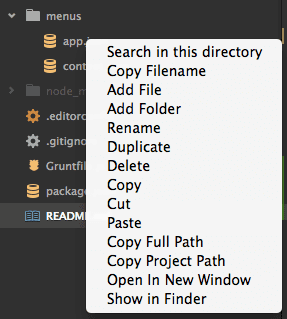

# Copy filename

[Atom package](https://atom.io/packages/copy-filename)

> Add a copy filename option to the tree view and a command to copy filename of opened file

  


## Install
```bash
$ apm install copy-filename
```
Or Settings ➔ Packages ➔ Search for `copy-filename`

## Shortcut
| Keypress  | Command |
| ------------- | ------------- |
| ⌥⌃⇧F | Copy filename of current focused file  |

## License

[MIT](http://opensource.org/licenses/MIT) © [Marius Rumpf](http://mariusrumpf.de)
